# PHI-Aware Q&A System Architecture

```mermaid
graph TD
    %% Main Components
    User(("👤 User"))
    UI[/"🖥️ Gradio UI"/]
    API["⚡ FastAPI Server"]
    LLM["🤖 Google Gemini LLM"]
    
    subgraph "LangGraph Workflow"
        direction TB
        NodeA["Node A<br/>Input Processing<br/>📥"]
        NodeB["Node B<br/>LLM Response Generation<br/>💭"]
        NodeC["Node C<br/>PHI Detection & Filtering<br/>🔒"]
        
        NodeA --> NodeB
        NodeB --> NodeC
    end
    
    %% Data Flow
    User -->|"Asks Question"| UI
    UI -->|"HTTP Request"| API
    API -->|"Initialize"| NodeA
    NodeB -->|"Generate"| LLM
    LLM -->|"Response"| NodeB
    NodeC -->|"PHI Check"| Check{{"PHI Detected?"}}
    Check -->|"Yes"| Redact["🚫 Redact PHI"]
    Check -->|"No"| Pass["✅ Pass Through"]
    
    Redact --> Response["Final Response"]
    Pass --> Response
    Response -->|"Update"| UI
    UI -->|"Display"| User
    
    %% Styling
    classDef primary fill:#2563eb,stroke:#fff,stroke-width:2px,color:#fff
    classDef secondary fill:#f59e0b,stroke:#fff,stroke-width:2px,color:#fff
    classDef success fill:#10b981,stroke:#fff,stroke-width:2px,color:#fff
    classDef warning fill:#ef4444,stroke:#fff,stroke-width:2px,color:#fff
    
    class UI,API primary
    class LLM secondary
    class NodeA,NodeB,NodeC success
    class Redact warning
    
    %% Notes
    style User fill:#f3f4f6,stroke:#374151
    style Check fill:#f3f4f6,stroke:#374151
    style Pass fill:#dcfce7,stroke:#166534
    style Response fill:#e0f2fe,stroke:#0369a1
```

## Architecture Overview

1. **User Interface (Gradio)**
   - Chat-style interface
   - History display
   - Mobile-responsive design

2. **FastAPI Server**
   - HTTP endpoint handling
   - Request processing
   - Error handling

3. **LangGraph Workflow**
   - Node A: Input validation and preprocessing
   - Node B: LLM interaction with Gemini
   - Node C: PHI detection and filtering

4. **PHI Protection**
   - Automated PHI detection
   - Content redaction
   - Privacy preservation

5. **Components**
   - Google Gemini LLM
   - Environment configuration
   - Secure response handling
