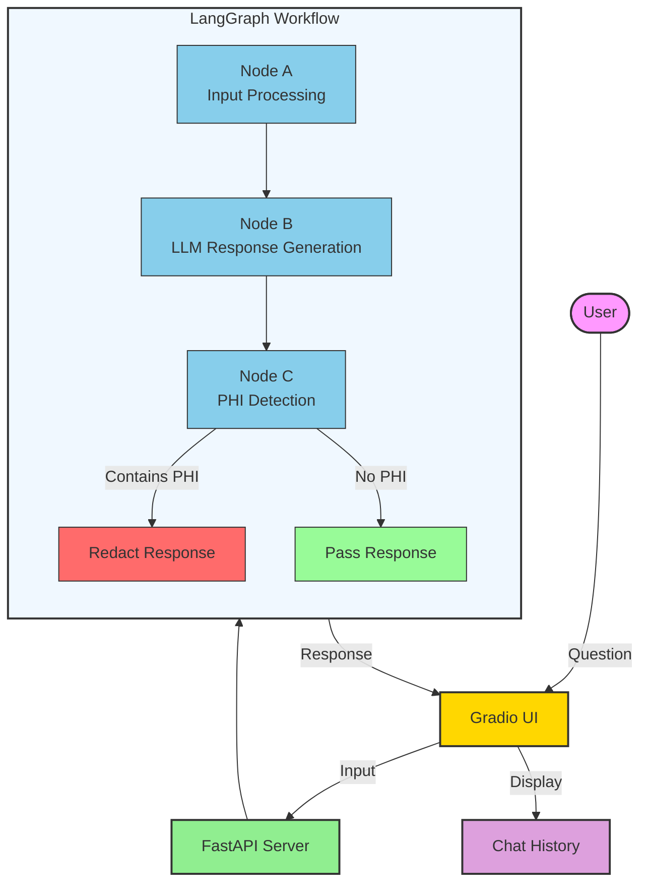

```mermaid
flowchart TB
    User([User]) --> |Question| UI[Gradio UI]
    UI --> |Input| API[FastAPI Server]
    
    subgraph LangGraph[LangGraph Workflow]
        direction TB
        Node_A[Node A\nInput Processing] --> Node_B[Node B\nLLM Response Generation]
        Node_B --> Node_C[Node C\nPHI Detection]
        Node_C --> |Contains PHI| Redact[Redact Response]
        Node_C --> |No PHI| Pass[Pass Response]
    end
    
    API --> LangGraph
    LangGraph --> |Response| UI
    UI --> |Display| History[Chat History]
    
    style User fill:#f9f,stroke:#333,stroke-width:2px
    style UI fill:#ffd700,stroke:#333,stroke-width:2px
    style API fill:#90ee90,stroke:#333,stroke-width:2px
    style LangGraph fill:#f0f8ff,stroke:#333,stroke-width:2px
    style Node_A fill:#87ceeb,stroke:#333
    style Node_B fill:#87ceeb,stroke:#333
    style Node_C fill:#87ceeb,stroke:#333
    style Redact fill:#ff6b6b,stroke:#333
    style Pass fill:#98fb98,stroke:#333
    style History fill:#dda0dd,stroke:#333,stroke-width:2px
```
